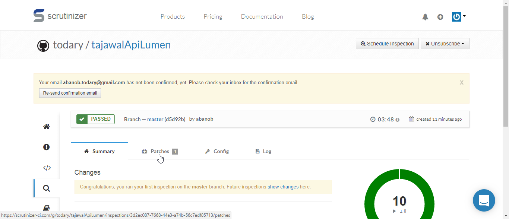

# Project Title
tajawal Task

[](https://travis-ci.org/travis-ci-examples/php)

## TASK
The objective of this challenge is to hit an endpoint containing the list of hotels and perform some actions on the result. It should be an easy task for anyone with basic programming skills. The challenge must be solved in PHP.

The URL containing the list of hotels can be found at [https://api.myjson.com/bins/tl0bp](https://api.myjson.com/bins/tl0bp)

## Requirements and Output

#### Create an application (console or RESTful API) to **allow search** in the given inventory by any of the following:

- Hotel Name
- Destination [City]
- Price range [ex: $100:$200]
- Date range [ex: 10-10-2020:15-10-2020]

and allow sorting by:

- Hotel Name
- Price

##Guidelines
the service can be found under 'micro-services/packages'
search logic  is in located under api
sort logic  is in located under sort


## Installation
Using Composer :

```
composer install
```

If you don't have composer, you can get it from [Composer](https://getcomposer.org/)


## How to  Run the application
this application used by call route 
types = name,destination,price,date
```
http://localhost/tajawalApiLumen/public/tajawal/{type}
```

to search by name
```
http://localhost/tajawalApiLumen/public/tajawal/name?name=Concorde Hotel&sort=price  
```

to search by destination
```
http://localhost/tajawalApiLumen/public/tajawal/destination?city=Manila&sort=price  

```


to search by price
```
http://localhost/tajawalApiLumen/public/tajawal/price?&min=1.2&max=100&sort=price  to search by price

```

to search by date
```
http://localhost/tajawalApiLumen/public/tajawal/date?from=10-10-2020&to=15-10-2020  
```

to sort add anther parameter (sort) type(name | price)  & order (1) to sort asc (0) to sort desc
Example

to search by name and sort by price
```
http://localhost/tajawalApiLumen/public/tajawal/name?name=Concorde Hotel&sort=price&order=1  
```


## Tests
To run tests make sure you are in the main folder, and then you can run this command line :

```
./vendor/bin/phpunit

```

## My coverage for  testing
http://localhost/tajawalApiLumen/tests/coverage/sort/index.html

### CI

- Implement[scrutinizer-ci](https://scrutinizer-ci.com)  CI tool for the project




## Built With

* [PHP7.1](http://php.net)
* [lumen5.5](https://lumen.laravel.com/docs/5.6)
* [Micro Service]


